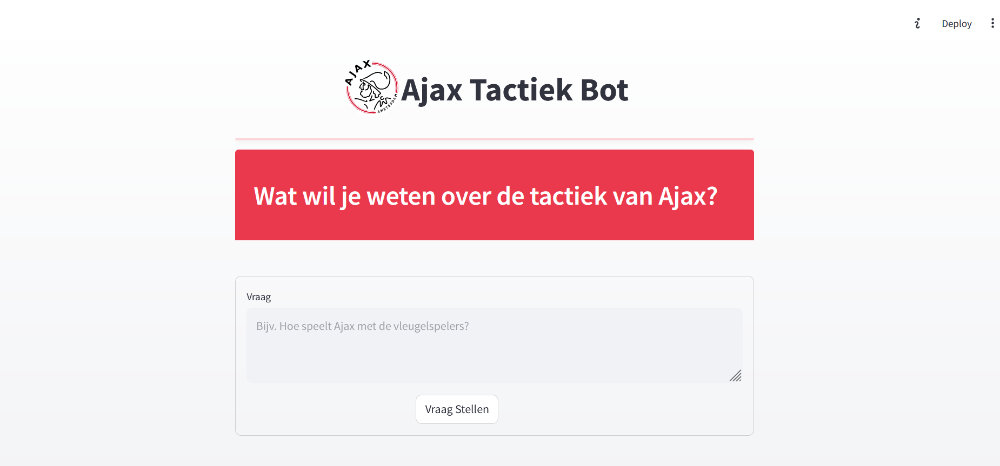

# Ajax Tactiek Bot 🔴⚪

A Streamlit-based chatbot application that answers questions about AFC Ajax Men's football tactics. The bot uses AI to analyze Dutch football videos and provide detailed tactical insights about Ajax's playing style.



## Project Overview

Ajax Tactiek Bot combines the power of:
- YouTube transcript processing for building a knowledge base
- Vector search (FAISS) for retrieving relevant tactical information
- OpenAI's GPT-4o-mini for generating detailed, contextual responses
- Streamlit for creating an intuitive user interface

The application processes Dutch football videos about Ajax, extracts tactical insights, and allows users to ask questions about Ajax's playing style, formations, and strategies.

## Repository Structure

```
football-tactics-chatbot/
├── data/               # FAISS vector database storage
├── docs/              
│   └── images/        # Project images and screenshots
├── src/               # Source code
│   ├── app/           # Streamlit application code
│   │   └── app.py     # Main application interface
│   ├── llm/           # Language model integration
│   │   └── get_question_answer.py  # Q&A logic using FAISS and GPT-4
│   ├── preprocessing/ # Video processing and database generation
│   │   └── generate_vector_db.py  # YouTube processing and FAISS DB creation
│   └── sandbox.py     # Development testing
├── .env               # Environment variables (API keys)
├── requirements.txt   # Project dependencies
└── README.md         # Project documentation
```

## Getting Started

### Prerequisites

- Python 3.8 or higher
- Git
- OpenAI API key

### Environment Setup

1. Clone the repository:
```bash
git clone https://github.com/RomekVinkeGit/football-tactics-chatbot
cd football-tactics-chatbot
```

2. Create and activate a virtual environment:
```bash
# Windows
python -m venv venv
.\venv\Scripts\activate

# macOS/Linux
python3 -m venv venv
source venv/bin/activate
```

3. Install dependencies:
```bash
pip install -r requirements.txt
```

### OpenAI API Key Setup

1. Sign up for an OpenAI account at [platform.openai.com](https://platform.openai.com)
2. Navigate to the API section and create a new API key
3. Create a `.env` file in the project root:
```bash
touch .env
```
4. Add your OpenAI API key to the `.env` file:
```
OPENAI_API_KEY=your-api-key-here
```

## Usage

### Building the Knowledge Base

1. The application needs to process YouTube videos to build its knowledge base. Run:
```bash
cd src/preprocessing
python generate_vector_db.py
```

This will:
- Download transcripts from predefined Ajax tactical analysis videos
- Process them into searchable chunks
- Create a FAISS vector database in the `data` directory

### Running the Application

1. From the project root, run:
```bash
cd src
streamlit run app.py
```

2. Open your browser and navigate to `http://localhost:8501` (or the URL shown in your terminal)

3. Use the application:
   - Type your question about Ajax tactics in the text area
   - Click "Vraag Stellen" (Ask Question)
   - Wait for the response (processing time may vary)

### Example Questions

- "Hoe speelt Ajax met de vleugelspelers?"
- "Wat is de rol van de nummer 10 in het Ajax systeem?"
- "Hoe past Ajax pressing toe?"

## Development Process

This project was developed using AI-assisted coding tools:

- **Cursor**: An AI-powered IDE that helped with code generation, refactoring, and documentation
- **Lovable**: An AI tool that assisted with development workflow and code improvements

The development process combined:
1. AI-generated code based on prompts (available in the `prompts/` directory)
2. Manual refinements and customizations
3. Iterative improvements through AI-human collaboration

This approach allowed for rapid development while maintaining code quality and implementing best practices. 

